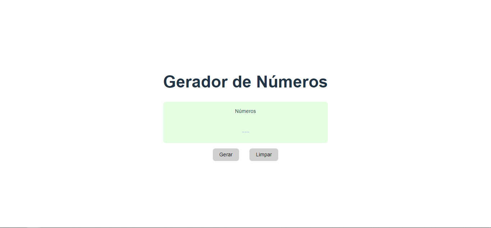
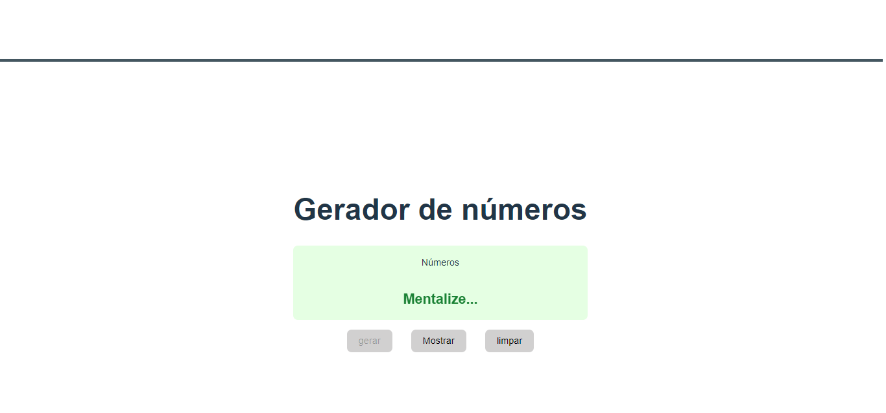
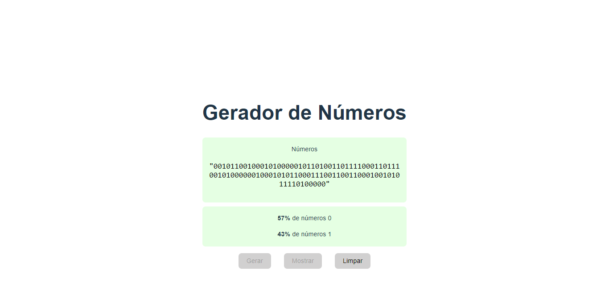

<h1>Gerador de números binários(conceito mecânica quântica) </h1> 

<p align="center">
  
  
   
</p>

> Status do Projeto: :heavy_check_mark:

### Tópicos 

:small_blue_diamond: [Descrição do projeto](#descrição-do-projeto)

:small_blue_diamond: [Funcionalidades](#funcionalidades)

:small_blue_diamond: [Pré-requisitos](#pré-requisitos)

:small_blue_diamond: [Author](#author)

:small_blue_diamond: [Licença](#licença)


## Descrição do projeto 

<p align="justify">
  Gerador de numeros binários com base no conceito de mecânica quântica onde o observador determina o resultado final. o sistema gera 100 caracteres entre 0 ou 1 e apresenta os números e a maioria percentual de cada um.
</p>

## Funcionalidades

:heavy_check_mark: Gerando o seu binário

<div align="center"> 
	
</div>

:heavy_check_mark: Mentalize o seu desejo em maioria zeros ou uns. 

<div align="center"> 
	
</div>

:heavy_check_mark: Apresentação do resultado Final.  

<div align="center"> 
	
</div>

## Pré-requisitos

:warning: [Node](https://nodejs.org/en/download/)

Após instalados as dependências execute:

```
npm run dev

```

...

## Author

<a href="https://www.facebook.com/vinicius.garcia.3386585">
 
 <br />
  
 <sub><b>Vinícius G. Leão</b></sub></a> <a href="https://www.facebook.com/vinicius.garcia.3386585" title="facebook"></a>
 <br />

 [](https://www.linkedin.com/in/vinicius-garcia-dev/) 
[](mailto:viniciusgarcia49@gmail.com)

---

## Licença 

The [MIT License]() (MIT)
